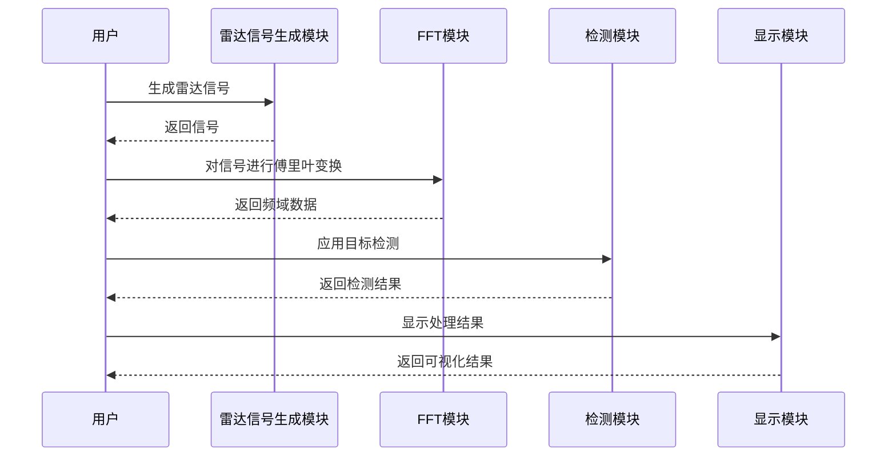

## 一、实验目的

1. 以雷达信号处理为例，掌握信号处理与检测的基本流程
2. 实践带通滤波器的设计与应用
3. 学习频谱分析与信号检测（峰值检测）方法
4. 培养信号处理算法的Python或Matlab的实现能力

## 二、实验内容

实现包含以下功能的雷达信号处理系统：

```python
信号生成 -> 滤波处理 -> 频谱分析 -> 峰值检测 -> 结果可视化
```

## 三、实验要求

### 1. 信号生成模块

* 生成时间轴：0-10秒，采样点1000个
* 创建含噪声的正弦信号：
	* 基频：5Hz
	* 噪声：高斯白噪声 (均值0, 标准差0.5)
* 要求输出原始信号时域图

### 2. 滤波器模块

* 实现Butterworth带通滤波器
* 函数接口要求：

```python
def butter_bandpass_filter(data, lowcut, highcut, fs, order=5)
```

* 参数规范：
	* 截止频率：4-6Hz
	* 采样频率：1000Hz
	* 滤波器阶数：5阶
* 使用零相位滤波 (filtfilt)

### 3. 频谱分析模块

* 实现功率谱计算函数：

```python
def compute_power_spectrum(signal, fs)
```

* 技术要求：
	* 使用FFT进行频谱计算
	* 执行归一化处理 (除以信号长度)
	* 仅返回有效半频谱 (0 - Nyquist频率)

### 4. 峰值检测模块

* 实现基于阈值的峰值检测算法：

```python
def detect_peaks(data)
```

* 检测条件：
	* 峰值点功率需大于最大功率的50%
	* 满足局部最大值条件 (前、后点均小于当前点)
* 输出检测到的频率值 (精确到小数点后两位)

### 5. 可视化模块

* 绘制双子图显示：
	* 子图1：原始信号与滤波后信号的时域对比
	* 子图2：功率谱图 (标注检测到的峰值点)
* 图形要求：
	* 包含坐标轴标签和标题
	* 峰值点用红色圆圈标记
	* 使用plt.subplot实现布局

## 五、序列图

各模块件的序列图如下：



## 四、实验步骤

### 1. 环境配置

* Python 3.8+
* 安装依赖库：numpy, scipy, matplotlib

### 2. 代码结构规范

```python
|- main.py (主程序)
|- signal_generator.py (信号生成)
|- filters.py (滤波器模块)
|- spectrum_analyzer.py (频谱分析)
|- peak_detector.py (峰值检测)
|- visualizer.py (可视化)
```

### 3. 开发流程

* 阶段1: 验证信号生成正确性 (时域波形检查)
* 阶段2: 测试滤波器幅频响应 (输出4-6Hz通过特性)
* 阶段3: 验证频谱计算准确性 (确认5Hz分量存在)
* 阶段4: 调试峰值检测阈值 (避免漏检/误检)
* 阶段5: 集成测试 (端到端流程验证)

## 五、结果验证

### 预期输出

1. 控制台输出：

```python
Detected peaks at frequencies: [5.01]
```

1. 生成图表包含：
	* 原始信号的噪声特征
	* 滤波后信号的平滑波形
	* 功率谱中清晰的5Hz峰值标记

### 验收标准

| 指标 | 合格标准 |
|---|---|
| 频率检测误差 | < 0.1Hz |
| 峰值信噪比 | > 10dB |
| 滤波过渡带 | 3.8-6.2Hz |
| 计算耗时 | < 1s |

## 六、实验报告要求

注：实验报告最好通过语雀或其它类似的知识分享平台上提交链接，也可以用word文档+代码的形式提交。

### 1. 代码结构

* 模块化设计说明
* 关键函数接口文档

### 2. 实验结果

* 包含滤波前后的时/频域对比图
* 不同信噪比下的检测成功率曲线

### 3. 分析讨论

* 滤波器阶数对结果的影响
* 阈值选择对检测性能的影响
* 本算法的局限性及改进建议

### 4. 拓展思考

* 如何应对多目标信号场景？
* 实时处理实现的可行性分析


## 七、参考代码框架

```python
# 主程序示例
import numpy as np
from scipy.signal import filtfilt

def main():
    # 信号生成
    time = np.linspace(0, 10, 1000)
    signal = ...

    # 滤波处理
    filtered = butter_bandpass_filter(...)

    # 频谱分析
    freqs, powers = compute_power_spectrum(...)

    # 峰值检测
    peaks = detect_peaks(...)

    # 可视化
    plot_results(...)

if __name__ == "__main__":
    main()
```

## 八、注意事项

1. 滤波器设计时注意归一化频率计算
2. 频谱分析需正确处理直流分量
3. 峰值检测需考虑边界条件处理
4. 注意数组长度的匹配 (特别是滤波前后的数据长度)